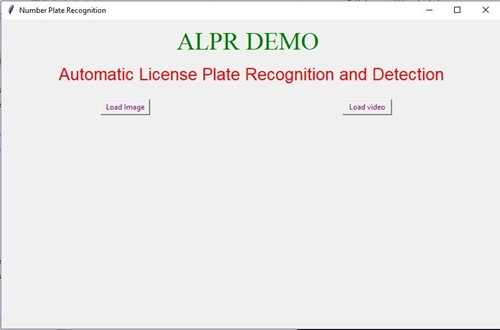
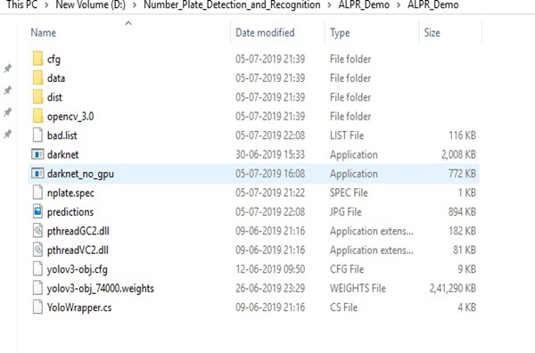
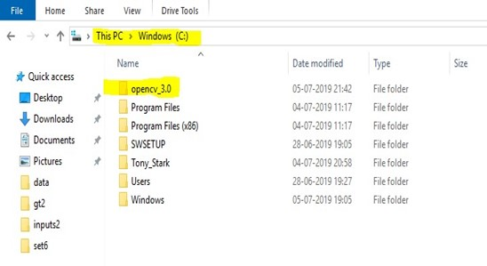
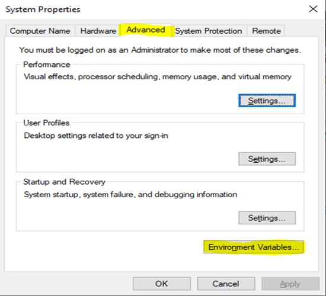
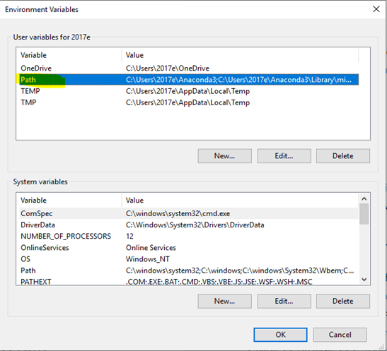
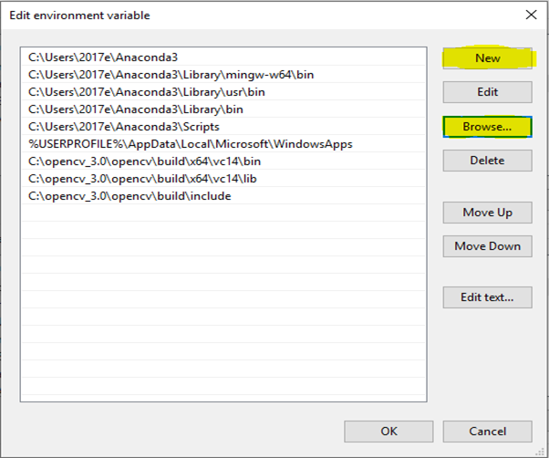
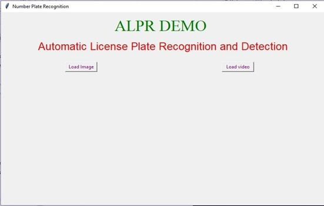
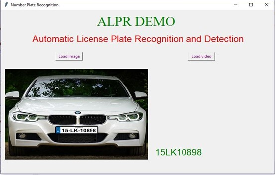

# ALPR
Automatic License Plate Detection and Recognition (Neural Network based approach for detection and recognition of characters of a number plate)

Automatic License Plate Detection and Recognition
=================================================

**Neural Network based Automatic License Plate Detection and
Recognition**\
 A *Graphical User Interface* is provided to run the application where
you can provide input in two formats :

1.  ***Images*** (*.jpg, .png*)
2.  ***Videos*** (.mp4, .3gp, .avi)

The view of GUI

The user can provide input images and videos of cars and bikes. The images or videos entered are processed by a neural network model and the result is shown in corresponding terminal and GUI. The result consists of the characters present in License plate of vehicle.

Requirements
------------

-   Windows OS

### Running on GPU

Running model on GPU needs the complete setup that includes the virtual
environment with GPU support. This includes :

-   **GPU with CC \>= 3.0**:
    [https://en.wikipedia.org/wiki/CUDA\#GPUs\_supported](https://en.wikipedia.org/wiki/CUDA#GPUs_supported)
-   **CMake \>= 3.8** for modern CUDA support:
    [https://cmake.org/download/](https://cmake.org/download/)
-   **CUDA 10.0**:
    [https://developer.nvidia.com/cuda-toolkit-archive](https://developer.nvidia.com/cuda-toolkit-archive)
    (on Linux do [Post-installation
    Actions](https://docs.nvidia.com/cuda/cuda-installation-guide-linux/index.html#post-installation-actions)
-   **OpenCV = 3.0**: use your preferred package manager (brew, apt),
    build from source using [vcpkg](https://github.com/Microsoft/vcpkg)
    or download from [OpenCV official
    site](https://opencv.org/releases.html) (on Windows set system
    variable `OpenCV_DIR` = `C:\opencv\build` - where are the `include`
    and `x64` folders
    [image](https://user-images.githubusercontent.com/4096485/53249516-5130f480-36c9-11e9-8238-a6e82e48c6f2.png))
-   **cuDNN \>= 7.0 for CUDA 10.0**
    [https://developer.nvidia.com/rdp/cudnn-archive](https://developer.nvidia.com/rdp/cudnn-archive)
    (on **Linux** copy `cudnn.h`,`libcudnn.so`… as desribed here
    [https://docs.nvidia.com/deeplearning/sdk/cudnn-install/index.html\#installlinux-tar](https://docs.nvidia.com/deeplearning/sdk/cudnn-install/index.html#installlinux-tar)
    , on **Windows** copy `cudnn.h`,`cudnn64_7.dll`, `cudnn64_7.lib` as
    desribed here
    [https://docs.nvidia.com/deeplearning/sdk/cudnn-install/index.html\#installwindows](https://docs.nvidia.com/deeplearning/sdk/cudnn-install/index.html#installwindows)
    )

> **Note:** The model can be run easily on CPU. For time being, if you
> are not concerned about the processing time and need to see the result
> right away. We suggest you to run the model without GPU.

### Running without GPU

-   Running model without GPU does not require any additional
    installation. This model runs even on CPU but takes slightly more
    time for processing.

-   Download the compressed .zip file from the repository. And extract
    at any location in your system.

-   You will see a folder named **ALPR\_Demo** in the directory.
    

-   Open the ALPR\_Demo folder. Cut and paste **opencv\_3.0** in C
    drive.
    
    
    
-   Search on windows for **Edit the system environment variables**.\

    In **System Properties** \>\> **Advanced** \>\> **Environment
    Variables** \>\> **User Variables** \>\> **PATH**\

     
    
    

    In Edit Environment Variable \>\>\

    -\> New \>\> Browse \>\>
    **C:\\opencv\_3.0\\opencv\\build\\x64\\vc14\\bin**\
     -\> New \>\> Browse \>\>
    **C:\\opencv\_3.0\\opencv\\build\\x64\\vc14\\lib**\
     -\> New \>\> Browse \>\>
    **C:\\opencv\_3.0\\opencv\\build\\include**

    After adding all opencv\_3.0 paths. The PATH window should include
    the above included paths in environment variable
    

    Click OK and Apply.

-   Setup is completed. Now open the directory ALPR\_Demo and click on
    **ALPR.exe** shortcut to run the application.\
     The GUI looks like this -
     
    

-   Click on **Load Image** tab to load an image to process. The result
    along with the image is displayed.

-   Click on **Load video** tab to load a video and run number plate
    detection and character recognition displayed on your screen.

-   Select the image or video you want to process. Wait for 5-6 seconds
    to load the model and the result will be displayed in the GUI.
    
    
    
-   This Application is just for the demonstration purpose of the neural
    network based model for Automatic License Plate Detection and
    Recognition
    
***Click here to download the project [ALPR_PROJECT](https://drive.google.com/file/d/1xwWsbDXjLdsX8DkuIkzBfeabldes3Y7x/view?usp=sharing)***
